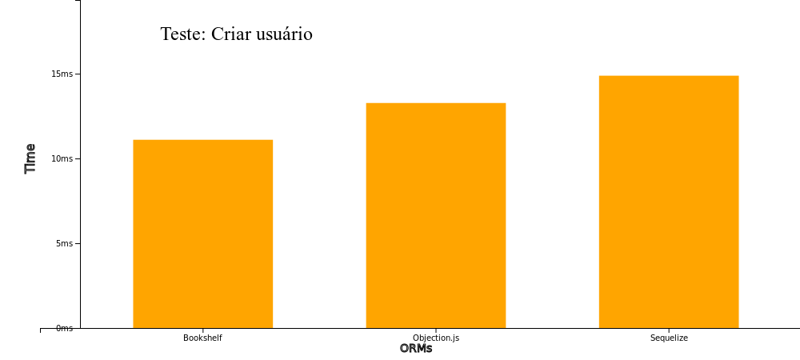
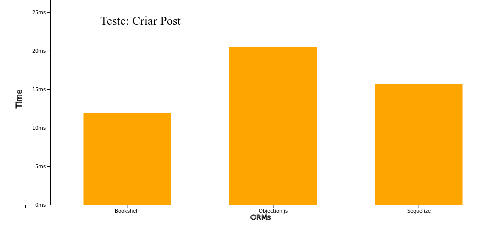
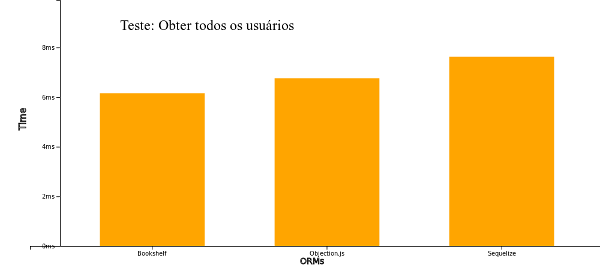
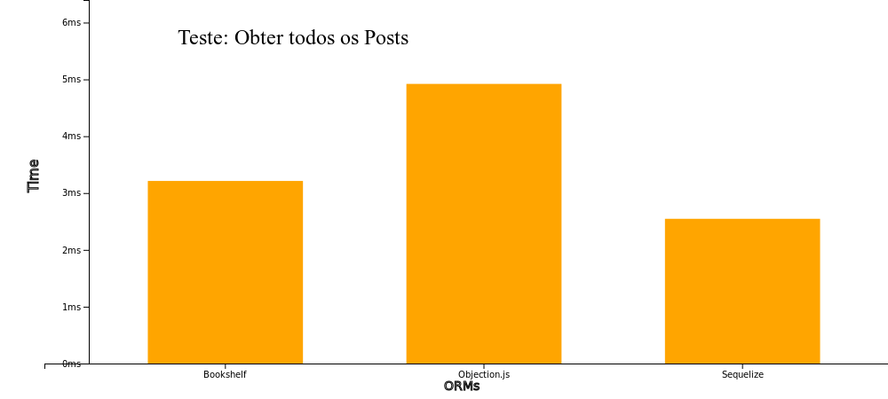
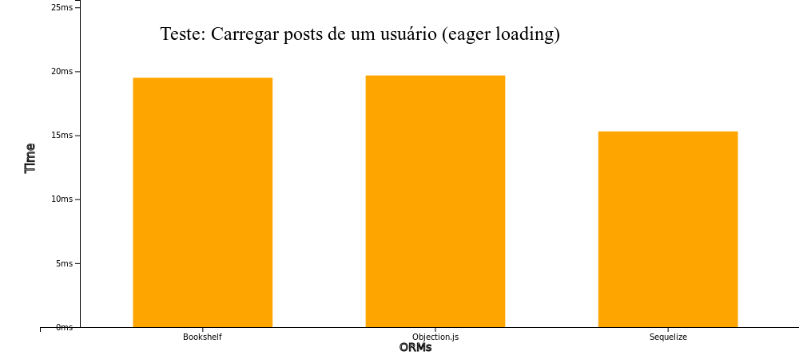

# Node.js ORM Benchmarks
Este repositório não tem como objetivo apontar de forma direta qual o melhor ORM, novos cenários ou até mesmo novas execuções do cenário abaixo (básico) podem modificar a performance de cada um.

## Executando o projeto na sua máquina
- É necessário ter o `Node.js` e `npm` instalado
- Instale as dependências executando:
  ```
    npm install
  ```
- Instale o `docker` e `docker-compose`
- Na raiz do projeto execute:
  ```
    docker-compose build && docker-compose up
  ```
- Após o docker-compose subir o container com o postgres, execute:
  ```
    npx knex migrate:latest && npx sequelize-cli db:migrate
  ```
- E para rodar os testes execute:
  ```
    bash exec.sh
  ```

## Testes:
1.  Inserção de dados na tabela de usuário
2.  Inserção de dados na tabela de posts
3.  Obter dados da tabela de usuário
4.  Obter dados da tabela de posts
5.  Obter todos os posts de um usuário

### Tabelas
- Usuário
  ```
  id: auto increment,
  first_name: string,
  last_name: string,
  created_at: timestamp,
  updated_at: timestamp,
  deleted_at: timestamp
  ```

- Post
  ```
  id: auto increment,
  user_id: integer (fk),
  title: string,
  description: string,
  content: text,
  likes: bigInteger,
  private: boolean,
  col_float: float
  col_decimal: decimal,
  col_date: date,
  col_enum: enu(['value1', 'value2']),
  col_json: json,
  col_jsonb: jsonb,
  created_at: timestamp,
  updated_at: timestamp,
  deleted_at: timestamp
  ```

## Resultados

### Resultado da SQL gerada
Como `Objection.js` e `Bookshelf` usam o knex, ambos serão apresentado de forma agrupada;
<br>
- Criar usuário
  -  Sequelize
    ```
      INSERT INTO "users" ("id","first_name","last_name","created_at","updated_at") VALUES (DEFAULT,$1,$2,$3,$4) RETURNING "id","first_name","last_name","created_at","updated_at";
    ```
  - Objection.js e Bookshelf
  ```
    insert into "users" ("first_name", "last_name") values (?, ?) returning "id"
  ```
- Criar post
  -  Sequelize
    ```
      INSERT INTO "posts" ("id","title","description","content","user_id","created_at","updated_at") VALUES (DEFAULT,$1,$2,$3,$4,$5,$6) RETURNING "id","title","description","content","user_id","deleted_at","created_at","updated_at","user_id";
    ```
  - Objection.js e Bookshelf
  ```
    insert into "posts" ("content", "description", "title", "user_id") values (?, ?, ?, ?) returning "id"
  ```

- Buscar usuarios
  -  Sequelize
    ```
      SELECT "id", "first_name", "last_name", "created_at" AS "createdAt", "updated_at" AS "updatedAt" FROM "users" AS "User";
    ```
  - Objection.js e Bookshelf
  ```
    select "users".* from "users"
  ```

- Buscar posts
  -  Sequelize
    ```
      SELECT "id", "title", "description", "content", "user_id", "deleted_at", "created_at" AS "createdAt", "updated_at" AS "updatedAt", "user_id" AS "UserId" FROM "posts" AS "Post";
    ```
  - Objection.js e Bookshelf
  ```
    select "posts".* from "posts"
  ```

- Buscar posts de um usuário (eager loading)
  -  Sequelize
    ```
      SELECT "User"."id", "User"."first_name", "User"."last_name", "User"."created_at" AS "createdAt", "User"."updated_at" AS "updatedAt", "Posts"."id" AS "Posts.id", "Posts"."title" AS "Posts.title", "Posts"."description" AS "Posts.description", "Posts"."content" AS "Posts.content", "Posts"."user_id" AS "Posts.user_id", "Posts"."deleted_at" AS "Posts.deleted_at", "Posts"."created_at" AS "Posts.createdAt", "Posts"."updated_at" AS "Posts.updatedAt", "Posts"."user_id" AS "Posts.UserId" FROM "users" AS "User" LEFT OUTER JOIN "posts" AS "Posts" ON "User"."id" = "Posts"."user_id" WHERE "User"."id" = 202;
    ```
  - Objection.js e Bookshelf <br>
    *Executa duas queries*
  ```
    1º -> select "users".* from "users" where "id" = ?'
    2º -> select "posts".* from "posts" where "posts"."user_id" in (?)
  ```

### Tempo gasto para executar as queries
<div align="center">
  
</div>
<br>
<br>
<div align="center">
  
</div>
<br>
<br>
<div align="center">
  
</div>
<br>
<br>
<div align="center">
  
</div>
<br>
<br>
<div align="center">
  
</div>
